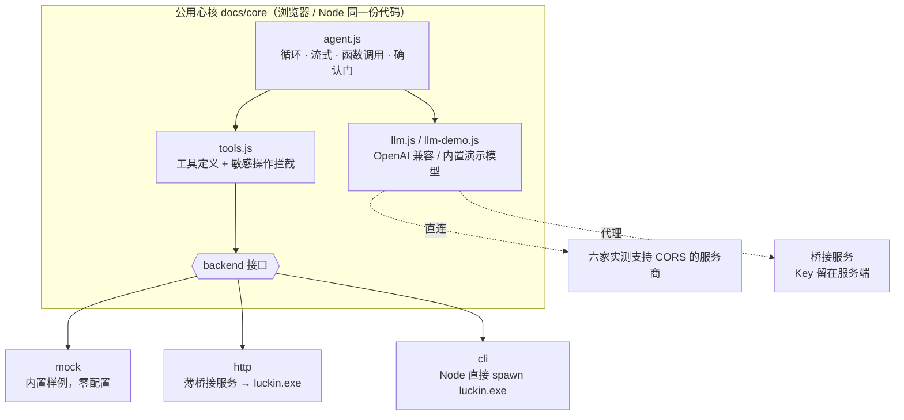

# ☕ 瑞幸点单 Agent

🔗 **在线演示**：<https://sunlvzheng.github.io/luckin-coffee-agent/> —— 打开即是演示模式，零配置、不会下单扣款。

一套**公用心核**（纯 ESM JavaScript，浏览器 / Node 通用）+ 可插拔后端，把瑞幸官方的点单能力做成
一个干净的对话式 Agent。既可以直接丢到 **GitHub Pages 当静态站**，也可以在本机跑成**真实下单**的服务。



> 换后端不换 Agent：点单流程、工具、提示词、事件协议全都只有一份。

---

## 1. 三种用法

| 用法 | 数据来源 | 模型 | 能真实下单 | 需要部署 |
|---|---|---|---|---|
| **静态演示** | 内置样例（mock） | 内置演示模型 / 自填 Key 直连 | ❌ | 丢到 GitHub Pages 即可 |
| **本地完整版** | 本机 luckin CLI | 自填 Key 直连 或 服务端代理 | ✅ | 本机跑一条命令 |
| **Node 终端版** | 本机 luckin CLI | 同上 | ✅ | 无需浏览器 |

### 部署到 GitHub Pages（3 步）

> 想省事可以直接跑 `scripts/deploy_pages.ps1`，它会自动做本地提交、推送，并在装了 GitHub CLI 时
> 连「建仓库 + 开 Pages」一起完成：
>
> ```powershell
> powershell -ExecutionPolicy Bypass -File .\scripts\deploy_pages.ps1 -Owner 你的用户名
> ```
>
> 脚本不需要你的任何令牌。第一次 `git push` 会弹出 GitHub 登录窗口（由 Git Credential Manager 处理），
> 登录后令牌存在 Windows 凭据管理器里。下面是手动步骤：

```bash
# 1. 推到 GitHub（Pages 的免费额度要求仓库是 public）
git init
git add .
git commit -m "feat: luckin coffee agent"
git branch -M main
git remote add origin https://github.com/<你的用户名>/<仓库名>.git
git push -u origin main
```

```
# 2. 仓库页面 → Settings → Pages
#    Source 选 "Deploy from a branch"
#    Branch 选 main，目录选 /docs，保存

# 3. 等 1 分钟左右，访问
#    https://<你的用户名>.github.io/<仓库名>/
```

页面就是 `docs/index.html`，纯静态、无构建步骤、无 npm 依赖，所有资源都是相对路径，
所以放在 `user.github.io/<仓库名>/` 这种子路径下也能正常加载。

**访客打开就是「演示模式」**：内置样例数据 + 内置演示模型，能完整走一遍
找门店 → 挑商品 → 试算 → 确认下单 → 支付版面，不需要任何 Key、也不会产生任何订单。
想用真实模型的话，自己选服务商填 Key 即可（见第 2 节）。

上传前想本地确认部署效果？一条命令模拟同样的托管环境（含子路径）：

```bash
node scripts/serve_static.mjs 8090 /luckin-agent
# 然后打开 http://127.0.0.1:8090/luckin-agent/
```

> ⚠️ GitHub Pages 对静态资源带约 10 分钟缓存。改完代码推上去后如果页面「看着没变」，
> 先用 `Ctrl+F5` 强刷；还是旧的说明缓存没到期，等几分钟再看（`index.html` 与 `app.js`
> 可能一新一旧，这种混合状态很容易误判成代码 bug）。

### 本地完整版（真实下单）

```powershell
copy .env.example .env       # 按需填写（见下方「配置」）
powershell -ExecutionPolicy Bypass -File .\run.ps1
```

启动时桥接服务会先做一遍**自检**，并自动打开浏览器：

```
====================================================================
  瑞幸点单 Agent · 桥接服务
====================================================================
  ✅ luckin CLI  : C:\Users\<你>\AppData\Local\.luckin\bin\luckin.exe
  ✅ 瑞幸登录态  : 已登录
  ➖ 服务端模型 : 未配置（不影响 —— 网页里选「直连模型」填自己的 Key 即可）
  ➖ 访问地址   : http://127.0.0.1:8000
  ⚠️  访问口令   : 未设置（局域网共享时建议设一个）
  ✅ 允许跨域   : https://<你的用户名>.github.io
====================================================================
```

**不用手动填地址**：页面打开后会自己探测本机桥（`127.0.0.1:8000` / `localhost:8000`），
探到就在顶部显示 `🔌 本机服务已就绪`，并给一个「切换为真实数据」按钮，点一下即可。

探不到也没关系：顶部会提示「连不上本机服务 → 打开配置向导」，向导里有**三步实时打勾**的清单
（装 CLI / 登录 / 起桥），每条命令旁边都有「复制」按钮，做完点「重新检测」；如果探到的是
`localhost` 而当前后端地址是 `127.0.0.1`（两者不同源），可以直接点「用本机服务」一键改好。

不想自动开浏览器就设 `BRIDGE_NO_BROWSER=1`。

也可以直接跑 Node 终端版：

```powershell
node bin/coffee.mjs           # 走本机 luckin.exe
node bin/coffee.mjs --demo    # 不连真实接口，只看流程
```

### 不想装 Python？用单文件 exe

**直接下载**：<https://github.com/sunlvzheng/luckin-coffee-agent/releases/latest>
（`luckin-bridge.exe`，约 15 MB，网页已打包进去，双击即用）

自己打包：

```powershell
powershell -ExecutionPolicy Bypass -File .\scripts\build_exe.ps1
# 产物：dist\luckin-bridge.exe
```

把 exe 拷到任意目录双击即可 —— 它会做同样的自检、托管同一个网页、自动开浏览器。
需要自定义配置就在 exe 旁边放一个 `.env`（exe 不会去别处找）。首次运行 Windows 可能提示
「未知发布者」，选「更多信息 → 仍要运行」。

想发布新版本到 Releases（凭据复用 Git Credential Manager，脚本可重复运行）：

```powershell
powershell -ExecutionPolicy Bypass -File .\scripts\release.ps1 -Tag v0.2.0
```

---

## 2. 模型：选服务商 + 填临时 Key（Key 不经过服务器）

在「设置 → 模型来源 → 直连模型」里：

1. **选服务商** → 自动填好接口地址、模型候选、Key 申请入口；
2. **粘一个自己的临时 Key** → 只写进浏览器 `localStorage`；
3. 点「测试连接」→ 用一个最小请求验证 Key 和跨域，通过后即可开聊。

请求由**浏览器直接发往服务商**，不经过本站服务器（静态页面根本没有后端）。
公用电脑上用完后点「清除 Key」即可。

内置服务商（`browser` 一列是**实测**结果：先做 `OPTIONS` 预检，再发一次真实 POST，
只有「真实响应里确实带 `Access-Control-Allow-Origin`」才算可直连）：

| 分组 | 服务商 | 浏览器直连 |
|---|---|---|
| 国内 | DeepSeek 官方 | ✅ 默认推荐 |
| 国内 | 硅基流动 SiliconFlow | ✅ |
| 国内 | 月之暗面 Kimi | ✅ |
| 国内 | 智谱 GLM | ✅ `glm-4-flash` 有免费额度 |
| 国内 | 阿里云百炼（通义千问） | ✅ |
| 国内 | 百度千帆（文心） | ✅ |
| 国内 | MiniMax | ✅ |
| 国内 | 阶跃星辰 StepFun | ✅ |
| 国内 | 火山方舟（豆包） | ⛔ 预检能过、真实响应却没有 CORS 头 → 只能用代理 |
| 海外 | OpenRouter | ✅ |
| 海外 | Together AI | ✅ |
| 海外 | OpenAI 官方 | ⛔ 不返回 CORS 头 → 只能用代理 |
| 本地 | Ollama | ⚠️ 需先设 `OLLAMA_ORIGINS=*` 并重启 Ollama |
| — | 自定义地址 | ❓ 取决于对方 CORS 配置，点「测试连接」一试便知 |

> 豆包这条特别值得说明：它的预检返回 200 且带了 ACAO，看起来完全可用，
> 但**实际 POST 的响应里没有 ACAO**，浏览器读不到结果，等于还是不可用。
> 所以这里的判定标准是看真实响应，而不是只看预检。

> 为什么下单不能像模型一样直连？实测瑞幸 MCP 网关的预检返回 401 且响应里没有
> `Access-Control-Allow-Origin`，浏览器读不到响应。所以真实下单必须经过桥接服务。

---

## 3. 配置（`.env`，只有本地版需要）

```ini
# 服务端模型：网页上选「经后端代理」时才需要，Key 留在服务端
LLM_BASE_URL=https://api.deepseek.com
LLM_API_KEY=sk-xxxx
LLM_MODEL=deepseek-chat

HOST=127.0.0.1
PORT=8000
# WEB_PASSWORD=my-secret          # 局域网/同事访问时务必设置
# WEB_ALLOW_ORIGINS=https://你的用户名.github.io   # 静态站连本机服务时才需要
# BRIDGE_NO_BROWSER=1             # 启动后不要自动打开浏览器
```

瑞幸登录态不用配：`luckin.exe` 自己读 `~/.luckin/.env` 里的 `LUCKIN_MCP_ORDER_TOKEN`
（没登录过就执行一次 `luckin login`）。模型也可以复用 CLI 的配置——
先用 `luckin models add ...` 配好，本项目检测到 `.env` 没配时会自动读取
`~/.luckin/config.json` 的 `models.profiles`。

---

## 4. 安全设计

* **下单确认门**：`create_order` / `cancel_order` 不会直接执行。后端在弹确认卡之前会**重新试算**一次
  金额，用户点「确认」才真正提交，避免「看到的钱数 ≠ 实际扣款」。
* **跨域默认关闭**：桥接服务默认不返回任何 CORS 头（只允许同源）。要放行托管在别处的静态页，
  必须显式配置 `WEB_ALLOW_ORIGINS`；填 `*` 且没设 `WEB_PASSWORD` 时启动会打印警告——
  否则任何网页都能调用你本机的服务下单。
* **口令**：设置 `WEB_PASSWORD` 后所有 `/api/*` 都要求 `X-Password`（浏览器预检不带自定义头，
  所以 OPTIONS 由中间件直接放行，这是符合规范的做法）。
* **命令白名单**：`/api/invoke` 只接受 6 条固定命令，不接受任意 CLI 参数。
* **Key 不出服务端**：「经后端代理」模式下浏览器拿不到模型 Key；「直连模型」模式下 Key 只在本机浏览器。
* **二维码本地生成**：`segno` 在服务端生成，不会把支付链接发给任何第三方服务。

---

## 5. Agent 干活的流程

一轮对话：`user → LLM（流式）→ 有 tool_calls 就依次执行 → 结果回填 → 再问 LLM → …`，
敏感工具则中断本轮，等界面确认后用 `resume()` 继续。

工具清单（全部落到 luckin CLI 的子命令）：

| 工具 | 对应命令 | 说明 |
|---|---|---|
| `set_location` | — | 记住用户坐标 |
| `find_stores` | `luckin store <纬度> <经度>` | 附近门店 |
| `search_products` | `luckin menu <deptId> <查询词>` | 查询词可直接带规格，返回匹配好的 `skuCode` |
| `preview_order` | `luckin order preview` | 试算金额 / 取餐时间 / 优惠券 |
| `create_order` | `luckin order create` | **需确认**，真实下单 |
| `get_order` | `luckin order detail` | 状态、取餐码 |
| `cancel_order` | `luckin order cancel` | **需确认** |

**关键点：不要自己拼 `skuCode`。** 瑞幸服务端的商品检索本身就能理解「冰 / 少少甜 / 大杯」，
返回的 `skuCode` 已经是匹配好的规格；提示词里明确禁止模型改写它，实测传错会被服务端拒绝。

界面与心核之间只靠一套事件协议通信（`docs/core/agent.js` 顶部有说明）：
`status / delta / tool_start / tool_end / cards / confirm / done / error`。

---

## 6. 目录结构

```
docs/                       ← 静态站点，直接部署到 GitHub Pages
  index.html  app.js  styles.css
  core/                     ← 公用心核（浏览器 + Node 通用）
    agent.js                循环 · 流式 · 确认门
    tools.js                工具定义与执行
    llm.js                  OpenAI 兼容流式客户端
    llm-demo.js             内置演示模型（无需 Key）
    providers.js            服务商预设（含实测 CORS 结论）
    prompt.js session.js format.js index.js
    backends/               mock.js · http.js · cli.js
coffee_agent/               ← 本地薄桥接服务（不含业务逻辑）
  server.py                 /api/invoke · /api/llm · /api/qr · /api/status + 托管 docs/
  luckin_cli.py             luckin.exe 异步封装
  settings.py               配置加载（区分打包资源目录与 exe 同目录的 .env）
bridge_main.py              ← 单文件 exe 入口
bin/coffee.mjs              ← Node 终端版
scripts/core_test.mjs       ← 心核离线自测
scripts/smoke.py            ← 真实 CLI 只读冒烟
scripts/build_exe.ps1       ← 打包单文件 exe
scripts/release.ps1         ← 发布到 GitHub Releases（幂等，可重复运行）
```

---

## 7. 自测

```powershell
node scripts/core_test.mjs        # 心核：27 项断言，含确认/取消两条分支（不产生订单）
.\.venv\Scripts\python.exe -m scripts.smoke 39.9042 116.4074   # 真实 CLI 只读链路
node scripts/serve_static.mjs 8090 /luckin-agent               # 本地预览静态站（模拟 Pages 子路径）
powershell -ExecutionPolicy Bypass -File .\scripts\build_exe.ps1   # 打包单文件 exe
```

---

## 8. 已知限制

* 浏览器**不能**直连瑞幸 MCP（对方无 CORS 头），所以静态站只能演示；真实下单需要桥接服务。
* 会话状态存在浏览器（刷新可恢复，换浏览器就没了）；桥接服务本身无状态。
* 若你先访问过早期版本、浏览器缓存里存了错误的 `Content-Type`，强制刷新一次（Ctrl+F5）即可。
* 仓库里的 `.ps1` 脚本是 **UTF-8 带 BOM** 保存的。PowerShell 5.1 读无 BOM 的 UTF-8 会按 GBK 解码，
  中文注释可能被解码出杂散字符直接导致语法错误——用 VS Code 编辑时请保持 "UTF-8 with BOM"。
* 定位：浏览器定位需要 https 或 localhost，其他情况直接把坐标发给 Agent
  （例如「我的位置是 39.9042, 116.4074」）。
